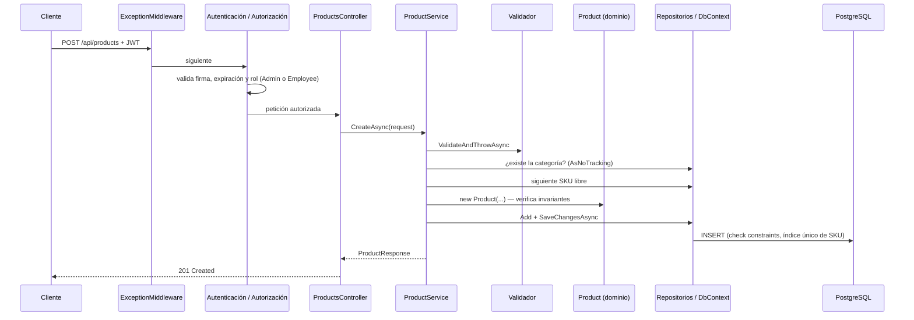

# Guía de incorporación

Esta guía es para quien se une al proyecto. En unos 30 minutos deberías poder levantar el sistema,
entender cómo está organizado y saber dónde va cada cambio.

## 1. Qué es el sistema

**Distribución Polar** es la API REST de una distribuidora mayorista de alimentos, bebidas y productos de limpieza.
Cubre la operación completa:
- Catálogo e inventario (galpón y camiones de reparto).
- Clientes con saldos y estado de cuenta.
- Facturación y regalías con control de envases retornables.
- Compras, averías, consumos internos y consignación.
- Reportes, auditoría y usuarios con roles.

Conceptos del negocio que aparecen en todo el código (ver [Lógica de negocio](03-LOGICA-NEGOCIO.md)):

| Término | Significado |
| --- | --- |
| **Caja / unidad suelta** | La mercancía se vende por caja o por unidad. Cada producto sabe cuántas unidades trae su caja. |
| **Stock en unidades** | El inventario siempre se guarda en unidades. "2 cajas + 5 und" es solo una forma de mostrarlo. |
| **Depósito** | Zona del almacén donde se guarda cada categoría (una categoría, un depósito). |
| **Vacíos** | Envases retornables (botellas de vidrio, gaveras). Solo ciertos productos los generan. |
| **SKU** | Código corporativo único del producto, con formato `CAT-PRO-0001`. |
| **Salud del stock** | Diagnóstico del nivel de inventario frente a su mínimo y su máximo. |
| **Galpón / camión** | El almacén central y los camiones de reparto; cada uno tiene su propio inventario. |
| **Saldo con signo** | Negativo = el cliente debe; positivo = saldo a favor. Aplica al dinero y a los vacíos. |
| **Abono / pendiente** | Abono = lo que paga al facturar o después; pendiente = total − abono (se carga al saldo). |
| **Regalía** | Despacho sin cobro de productos autorizados; sí genera vacíos. |
| **Anulación** | Reversa completa de una factura: inventario, pendiente y vacíos. Solo Admin. |

## 2. Levantar el proyecto

Requisitos: Docker con Docker Compose. Para programar y correr las pruebas también hace falta el SDK de .NET 10.

```bash
git clone https://github.com/Leynner2/DistribucionPolar.git
cd DistribucionPolar
docker compose up -d --build
```

Con eso quedan en marcha:

| Servicio | URL | Para qué |
| --- | --- | --- |
| API + Swagger | http://localhost:8080/swagger | Probar todos los endpoints |
| pgAdmin | http://localhost:5050 | Ver la base de datos (Servers → Distribución Polar) |
| PostgreSQL 15 | `localhost:5432` | Base de datos (`polar` / `polar_dev_2026`) |

Al arrancar en Development, la API aplica las migraciones y crea estos usuarios:

| Usuario | Clave | Rol |
| --- | --- | --- |
| `admin` | `Admin2026!` | Admin |
| `empleado` | `Empleado2026!` | Employee |
| `inactivo` | `Inactivo2026!` | Employee desactivado (el login responde 401) |

Primera prueba: en Swagger ejecuta `POST /api/auth/login`, copia el `token`, pulsa **Authorize**, pégalo
y luego ejecuta `GET /api/products`.

Para correr las pruebas automatizadas:

```bash
dotnet test DistribucionPolar.slnx                                      # unitarias + integración (requiere Docker)
npx newman run postman/collections/DistribucionPolar.postman_collection.json   # pruebas de la API
```

## 3. Recorrido por el código

La solución sigue la **Arquitectura Cebolla (Onion)**: el negocio está en el centro y no depende de nada.
La explicación completa está en [Arquitectura](02-ARQUITECTURA.md).

```text
Core.Domain/              Centro. Reglas de negocio puras: entidades, value objects, evaluadores.
Core.Application/         Casos de uso: servicios, DTOs, validadores y las interfaces que necesita.
Infrastructure/           Implementa esas interfaces: EF Core + PostgreSQL, JWT, hash de claves.
Presentation.API/         HTTP: controladores, middleware de errores, autenticación, Swagger.
Core.Domain.Tests/        Pruebas del dominio.
Core.Application.Tests/   Pruebas de validadores y servicios (sin base de datos).
Integration.Tests/        API real contra PostgreSQL desechable (Testcontainers).
docs/                     Esta documentación, script SQL y contrato OpenAPI.
postman/                  Colección de pruebas de la API.
```

Orden de lectura recomendado para entender el sistema:

1. `Core.Domain/Entities/Product.cs`: la entidad central y sus reglas.
2. `Core.Domain/ValueObjects/BoxQuantity.cs`: cajas ↔ unidades.
3. `Core.Application/Services/ProductService.cs`: un caso de uso completo.
4. `Infrastructure/Persistence/Configurations/ProductConfiguration.cs`: cómo se guarda en PostgreSQL.
5. `Presentation.API/Controllers/ProductsController.cs`: cómo se expone por HTTP y quién puede usarlo.
6. `Presentation.API/Middleware/ExceptionMiddleware.cs`: cómo se convierten los errores en respuestas.
7. `Core.Domain/Entities/Invoice.cs` y `Core.Application/Services/InvoiceService.cs`: el proceso más completo (transacción, stock, numeración, saldos, vacíos y anulación).
8. `Infrastructure/Persistence/ApplicationDbContext.cs`: `ExecuteInTransactionAsync`, la transacción de cada proceso.

## 4. Qué ocurre en una petición

Ejemplo: un empleado registra un producto con `POST /api/products`.



Si algo falla en cualquier punto, la excepción sube hasta `ExceptionMiddleware`, que responde con el
código HTTP adecuado en formato RFC 7807. Ningún controlador tiene `try/catch`.

Los procesos que tocan varias tablas (facturar, anular, cargar camión, compras, consignación…) agregan dos pasos:
- Envuelven todo en `IUnitOfWork.ExecuteInTransactionAsync`, una transacción ACID: todo o nada.
- Al terminar, registran la auditoría con `IAuditService`.

## 5. Cómo agregar una funcionalidad

Ejemplo: agregar proveedores (`Supplier`). Se trabaja **de adentro hacia afuera**:

| Paso | Capa | Qué crear | Ejemplo a imitar |
| --- | --- | --- | --- |
| 1 | Domain | Entidad que hereda de `BaseEntity`, con constructor que valida invariantes y setters privados | `Entities/Category.cs` |
| 2 | Application | `ISupplierRepository`, DTOs (`SupplierResponse`, `CreateSupplierRequest`…), validadores, `ISupplierService` + `SupplierService` | `Abstractions/ICategoryRepository.cs`, `Validators/CategoryValidators.cs`, `Services/CategoryService.cs` |
| 3 | Application | Registrar el servicio en `DependencyInjection.cs` (los validadores se registran solos) | — |
| 4 | Infrastructure | `SupplierConfiguration` (Fluent API), `SupplierRepository`, `DbSet` en `ApplicationDbContext`, registro en `DependencyInjection.cs` | `Configurations/CategoryConfiguration.cs` |
| 5 | Infrastructure | Migración: `dotnet ef migrations add AddSuppliers --project Infrastructure --startup-project Presentation.API --output-dir Persistence/Migrations` | — |
| 6 | Presentation | Controlador con `[Authorize(Roles = ...)]` y comentarios XML para Swagger | `Controllers/CategoriesController.cs` |
| 7 | Tests | Pruebas del dominio; del servicio con repositorios falsos; y de integración si hay transacciones o concurrencia | `Core.Application.Tests/Fakes.cs`, `Integration.Tests/BusinessScenarioTests.cs` |
| 8 | Postman | Peticiones con sus pruebas en la colección | `postman/collections/` |

Reglas que no se rompen:

- `Core.Domain` no referencia ningún otro proyecto ni paquete NuGet.
- Las reglas de negocio van en el dominio, no en los controladores.
- Los controladores no tienen `try/catch`: se lanzan excepciones y el middleware las traduce.
- Toda lectura usa `AsNoTracking()`; para modificar se usa un método `GetForUpdateAsync`.
- Sin Data Annotations en las entidades: el mapeo va en Fluent API, dentro de Infrastructure.
- Nada se borra físicamente: `MarkAsDeleted()` (borrado lógico).
- Montos en `decimal`, guardados como `numeric(18,2)`.
- Un proceso que modifica varias tablas va en `ExecuteInTransactionAsync` y termina con una entrada de auditoría.
- "Hoy" se obtiene de `IClock` (zona horaria de la empresa), nunca de `DateTime.Now`.

## 6. Convenciones

- **Idioma:** código en inglés; mensajes al usuario, comentarios y documentación en español.
- **Commits:** [Conventional Commits](https://www.conventionalcommits.org/), por ejemplo `feat(domain): agregar entidad Supplier`.
- **Errores:** siempre `application/problem+json` (RFC 7807).
- **Secretos:** nunca en el repositorio. Solo se versionan los `.env.*.example`.
- **Calidad:** la solución debe compilar con 0 advertencias y todas las pruebas deben pasar.

## 7. Dónde seguir

| Necesito… | Documento |
| --- | --- |
| Entender capas, dependencias, seguridad y persistencia | [02-ARQUITECTURA.md](02-ARQUITECTURA.md) |
| Conocer las reglas del negocio y dónde está cada una | [03-LOGICA-NEGOCIO.md](03-LOGICA-NEGOCIO.md) |
| Saber por qué algo se hizo de cierta forma | [04-DECISIONES.md](04-DECISIONES.md) |
| Relacionar la teoría de cada fase con el código | [06-FUNDAMENTOS.md](06-FUNDAMENTOS.md) |
| Ver qué requisito de cada fase cubre qué parte del código | [05-REQUISITOS-POR-FASE.md](05-REQUISITOS-POR-FASE.md) |
| Levantar Staging o Production | [README](../README.md#entornos) |
| Consultar el contrato de la API | `docs/openapi/openapi.yaml` o Swagger |
