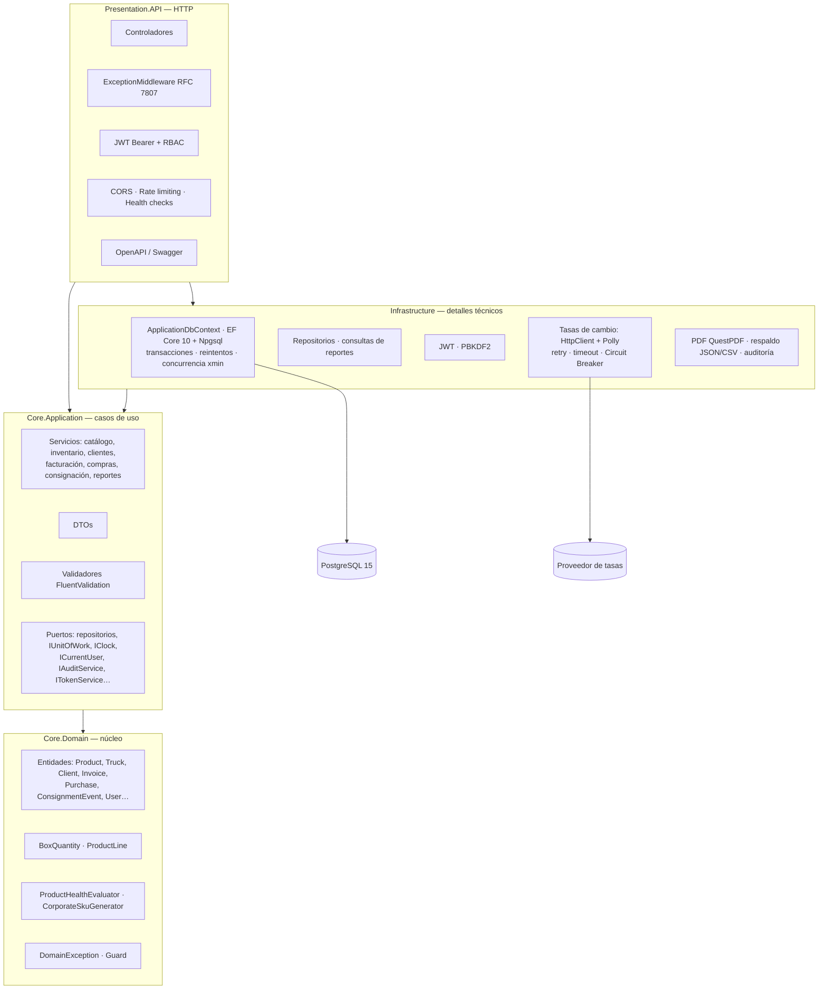
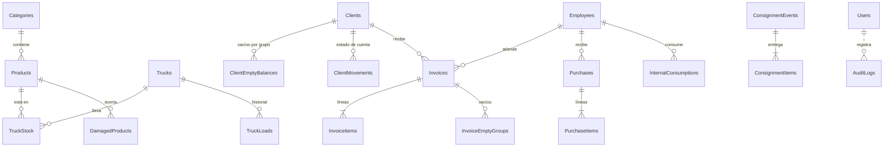

# Arquitectura

## 1. Visión general

La solución aplica la **Arquitectura Cebolla (Onion)** de Jeffrey Palermo con principios de
**Domain-Driven Design**: el dominio queda en el centro y todas las dependencias apuntan hacia él.



**Regla de dependencia:** una capa solo conoce a las capas más internas. Se cumple al compilar, porque cada
`.csproj` solo referencia lo que le está permitido:

| Proyecto | Referencias | Paquetes NuGet |
| --- | --- | --- |
| `Core.Domain` | ninguna | ninguno |
| `Core.Application` | Domain | FluentValidation |
| `Infrastructure` | Application, Domain | Npgsql EF Core, JsonWebTokens, Http.Resilience (Polly), QuestPDF |
| `Presentation.API` | Application, Infrastructure | JwtBearer, OpenApi, Swashbuckle.SwaggerUI, HealthChecks |

Como consecuencia:
- El dominio y los casos de uso se prueban sin base de datos ni servidor web.
- Cambiar PostgreSQL, el proveedor de tasas o la librería de PDF solo toca `Infrastructure`.

## 2. Responsabilidad de cada capa

### Core.Domain: el negocio

| Contiene | No contiene |
| --- | --- |
| Entidades con comportamiento (`Product.RemoveStock`, `Truck.AddStock`, `Client.ApplyPayment`, `Invoice.CreateSale`, `Invoice.Cancel`, `ConsignmentEvent.RegisterReturn`…) | Atributos de EF o de validación |
| Invariantes en constructores y métodos (`Guard`, `DomainException`) | Acceso a datos, HTTP, configuración, reloj del sistema |
| Value objects (`BoxQuantity`, `ProductLine`) | Referencias a otros proyectos o paquetes |
| Servicios de dominio puros (`ProductHealthEvaluator`, `CorporateSkuGenerator`) | DTOs |

Las entidades tienen setters privados y un constructor privado para EF Core. Las colecciones (`Invoice.Items`,
`Truck.Stock`, `Client.EmptyBalances`…) son de solo lectura, y solo se modifican con los métodos del agregado.
Ninguna entidad se puede construir ni dejar en estado inválido.

### Core.Application: los casos de uso

- **Servicios:** uno por área (`InvoiceService`, `TruckService`, `ClientService`, `ConsignmentService`…). Cada proceso:
  1. Valida la entrada.
  2. Abre una transacción.
  3. Carga las entidades.
  4. Invoca al dominio.
  5. Confirma.
  6. Registra la auditoría.
- **Puertos:** interfaces que la aplicación necesita y la infraestructura implementa (inversión de dependencias):
  - Repositorios e `IUnitOfWork`.
  - `IClock` (fecha del negocio) e `ICurrentUser` (usuario del token).
  - `IAuditService`, `IDocumentNumberGenerator`, `IExchangeRateProvider`, `IDocumentPdfGenerator` e `IBackupExporter`.
- **DTOs y validadores:** contratos de la API y reglas de formato de cada petición.

### Infrastructure: los detalles técnicos

- `ApplicationDbContext`: EF Core 10 + Npgsql. Implementa `IUnitOfWork` con transacciones explícitas.
- Configuraciones Fluent API por entidad, migraciones y siembra.
- Repositorios: `AsNoTracking` en las lecturas, `AsNoTrackingWithIdentityResolution` cuando una consulta repite entidades, y proyecciones `Select` a DTO en listados y reportes.
- Servicios técnicos:
  - Reloj del negocio (zona horaria).
  - Auditoría (con un `DbContext` propio).
  - Numeración atómica (SQL).
  - Tasas de cambio (HttpClient + resiliencia).
  - PDF.
  - Respaldo.
  - JWT y PBKDF2.

### Presentation.API: la entrada HTTP

- Controladores delgados agrupados por recurso, con permisos por rol y documentación OpenAPI.
- `ExceptionMiddleware` (RFC 7807), JWT Bearer, CORS, rate limiting, health checks y Swagger UI.
- `HttpCurrentUser`: implementa `ICurrentUser` con los claims del token y la IP de la conexión.

## 3. Pipeline HTTP

Orden definido en `Presentation.API/Program.cs`:

```text
Arranque:  DbInitializer → migraciones (si Database:MigrateOnStartup) + usuarios iniciales (si la tabla está vacía)
Petición:  ExceptionMiddleware → Swagger UI (si Swagger:Enabled) → CORS → Authentication → Rate limiting → Authorization → endpoint
```

- `ExceptionMiddleware` va primero para capturar las excepciones de todo lo que viene después.
- El rate limiting va después de la autenticación, para limitar **por usuario** cuando hay token y por IP cuando no.

## 4. Transacciones, concurrencia y numeración

### Transacción ACID por proceso

Cada proceso de negocio que toca varias tablas se ejecuta con `IUnitOfWork.ExecuteInTransactionAsync`:

```text
estrategia de reintentos de Npgsql
  └─ BEGIN
       cargar entidades → aplicar reglas del dominio → numerar → SaveChanges
     COMMIT   (cualquier excepción → ROLLBACK: no queda nada a medias)
```

- **Atomicidad:** una factura descuenta el inventario, carga el saldo, crea los movimientos y consume el número, todo o nada. Por ejemplo, si falta stock en una línea, no se descuenta ninguna.
- **Reintentos:** si la conexión con PostgreSQL falla de forma transitoria, el bloque completo se reintenta hasta 3 veces (`EnableRetryOnFailure`). Antes de cada intento se limpia el ChangeTracker.

### Concurrencia optimista (columna `xmin`)

`Product`, `Truck`, `Client`, `Invoice` y `ConsignmentEvent` usan la columna de sistema `xmin` de PostgreSQL
como token de concurrencia. Si dos operaciones modifican la misma fila a la vez, la segunda falla con
**409 Conflict**, en lugar de pisar los datos de la primera.

Es lo que impide vender dos veces las mismas unidades. Está verificado con una prueba de integración que
lanza 5 ventas simultáneas de las últimas 10 unidades: solo una se completa y el stock nunca queda negativo.

### Numeración atómica

Los correlativos (código de cliente, `Factura {Mes} {Año} #n`, `Regalía …`, `Compra #0001`) se obtienen con una
sola sentencia sobre la tabla `DocumentCounters`:

```sql
INSERT … ON CONFLICT ("Sequence","Year","Month") DO UPDATE SET "CurrentNumber" = … + 1 RETURNING "CurrentNumber"
```

PostgreSQL bloquea la fila del contador, así que dos usuarios nunca reciben el mismo número. Como corre dentro de
la transacción del proceso, una factura que falla no consume número.

## 5. Manejo de errores (RFC 7807)

Las capas internas lanzan excepciones y el middleware decide el código HTTP. Así ninguna capa interna conoce HTTP.

| Excepción | Origen | HTTP |
| --- | --- | ---: |
| `ValidationException` | FluentValidation | 400 con `errors` por campo |
| `DomainException`, `InvalidOperationException` | Reglas del dominio y de los casos de uso | 400 |
| `UnauthorizedAccessException` | Credenciales o usuario inactivo | 401 |
| `KeyNotFoundException` | Recurso inexistente | 404 |
| `DbUpdateConcurrencyException` | Concurrencia optimista (`xmin`) | 409 |
| `DbUpdateException` con código PostgreSQL 23505 / 23503 | Índice único o clave foránea | 409 |
| `RetryLimitExceededException` | Base de datos caída tras los reintentos | 503 |
| `ExternalServiceUnavailableException` | Proveedor de tasas caído y sin respaldo | 503 |
| Cualquier otra | — | 500 genérico |

Fuera del middleware:
- `AuthenticationSetup` responde 401 (sin token, o token inválido o expirado) y 403 (rol sin permiso).
- El rate limiter responde **429**, con el encabezado `Retry-After`.

Todas las respuestas usan `application/problem+json` con `type`, `title`, `status`, `detail`, `instance` y `traceId`.
El error 500 nunca incluye el stack trace.

## 6. Validación en tres niveles

| Nivel | Dónde | Propósito |
| --- | --- | --- |
| 1. Entrada | `Core.Application/Validators` | Rechazar datos mal formados con un 400 que lista todos los errores, en español |
| 2. Dominio | Constructores y métodos de las entidades | Ninguna entidad existe en estado inválido, venga de donde venga |
| 3. Base de datos | Check constraints, índices únicos y claves foráneas | Última red de seguridad ante cualquier acceso |

Ejemplos de check constraints:
- `Products`: precios > 0, costo ≥ 0, stock ≥ 0, máximo > mínimo.
- `TruckStock`: unidades > 0.
- `Invoices`: total y abono ≥ 0; una regalía no cobra; el despacho desde camión exige camión.
- `ConsignmentItems`: 0 ≤ devuelto ≤ entregado.

## 7. Seguridad

### Autenticación: JWT stateless
- `POST /api/auth/login` emite un JWT firmado con **HMAC-SHA256**.
- Claims: `sub`, `unique_name`, `email`, `name`, `role`, `jti`, `iss`, `aud`, `iat`, `nbf`, `exp`.
- Validación: emisor, audiencia, firma, expiración, algoritmo fijo `HS256` y tolerancia de reloj de 30 s.
- Clave en `JwtSettings:Key` (mínimo 32 bytes): sin una clave válida, la API no arranca.

### Autorización: RBAC
**Toda ruta exige un usuario autenticado** (política de respaldo); las públicas llevan `[AllowAnonymous]`.

| Área | Admin | Employee |
| --- | :-: | :-: |
| Consultar catálogo, inventario, camiones, clientes, facturas, consignaciones; tasas de cambio | ✔ | ✔ |
| Registrar productos y clientes; editar contacto del cliente | ✔ | ✔ |
| Cargar y transferir camiones | ✔ | ✔ |
| Facturar, regalías, abonos, devolución de vacíos, consignación | ✔ | ✔ |
| Editar o eliminar productos; gestionar categorías | ✔ | 403 |
| Ajustes manuales de inventario (galpón y camión), vaciar camión, crear y editar camiones | ✔ | 403 |
| Eliminar clientes, ajustar saldos, **anular facturas** | ✔ | 403 |
| Compras, averías, consumos internos | ✔ | 403 |
| Empleados (alta y edición), usuarios | ✔ | 403 |
| Reportes, balance, auditoría, respaldo | ✔ | 403 |

### Claves
PBKDF2 con HMAC-SHA256, 100.000 iteraciones, sal aleatoria de 16 bytes y comparación en tiempo constante.

### Protecciones adicionales
- **Rate limiting:**
  - Login: por IP, 5 intentos/min en Production y 10 en Staging (en Development el límite es alto para no frenar las pruebas).
  - Global: por usuario o por IP.
- **CORS:** solo los orígenes configurados por entorno (`Cors:AllowedOrigins`) pueden llamar a la API desde un navegador, y solo con los métodos y encabezados necesarios.
- **Secretos:** fuera del código (variables de entorno en Staging y Production).
- **Contenedor:** se ejecuta con un usuario sin privilegios.

## 8. Persistencia

PostgreSQL 15 con enfoque Code-First (EF Core 10). Las migraciones se versionan en
`Infrastructure/Persistence/Migrations`.



| Tabla | Claves e índices destacados |
| --- | --- |
| `Categories`, `Products`, `Users` | Ver Fase 2: UUID, SKU único, nombre de categoría único entre vigentes, username y email únicos |
| `Employees`, `Trucks` | UUID; placa única entre vigentes |
| `TruckStock` | PK compuesta (camión, producto); FK al camión en cascada; FK al producto `Restrict` |
| `TruckLoads` | Historial; índice (camión, fecha) |
| `Clients` | Código único; RIF único entre vigentes; saldos `numeric(18,2)` / enteros con signo |
| `ClientEmptyBalances` | PK (cliente, grupo) |
| `ClientMovements` | Índices (cliente, fecha) y (tipo, fecha) |
| `Invoices` | Número único; índices por fecha y (cliente, fecha); snapshot de cliente, camión y vendedor |
| `InvoiceItems`, `PurchaseItems`, `ConsignmentItems` | Copia de los datos del producto al momento (nombre, precios, unidades por caja) |
| `DamagedProducts`, `InternalConsumptions` | Índice por fecha |
| `AuditLogs` | PK **BIGINT identity**; `BeforeJson`/`AfterJson`/`MetadataJson` en **jsonb**; `IpAddress` en **inet**; `CreatedAt` con `DEFAULT NOW()` |
| `DocumentCounters` | PK (secuencia, año, mes) |

**Decisiones de modelado:**
- Los montos son `numeric(18,2)` y las fechas `timestamptz` (UTC).
- Los enums se guardan como texto legible.
- **Borrado lógico** con filtro global `!IsDeleted` en las entidades principales.
- **3FN:** los datos de una entidad viven en una sola tabla. Las líneas de documento guardan una copia intencional de precio y nombre porque son **históricas**: deben reflejar el momento de la operación, no el precio actual.

**Lecturas:**

| Técnica | Dónde |
| --- | --- |
| `AsNoTracking()` | Todas las consultas de lectura |
| `AsNoTrackingWithIdentityResolution()` | Camiones con su inventario (los productos y categorías se repiten entre camiones) y facturas con sus líneas |
| Proyección `Select` a DTO | Listado de facturas paginado, reportes, inventario por categoría y camión, auditoría |
| `AsSplitQuery()` | Facturas con líneas y vacíos (evita la explosión cartesiana de dos colecciones) |

**Siembra:**
- *Declarativa* (`HasData`, UUID fijos): categorías, productos, empleados, camiones y clientes de ejemplo.
- *Dinámica* (`DbInitializer`): usuarios, que necesitan un hash con sal.

## 9. Entornos y despliegue

La imagen de la API se construye en dos etapas (`Dockerfile`), se ejecuta como usuario sin privilegios y tiene
un healthcheck sobre `/health`, que comprueba también PostgreSQL.

| | Development | Staging | Production |
| --- | :-: | :-: | :-: |
| Archivo | `docker-compose.override.yml` | `docker-compose.staging.yml` | `docker-compose.prod.yml` |
| Puerto de la API | 8080 | 8081 | 8082 |
| Swagger / OpenAPI | ✔ | ✔ | ✘ |
| BD expuesta al host | ✔ | ✘ | ✘ |
| Secretos | valores de desarrollo | `.env.staging` obligatorio | `.env.production` obligatorio |
| Usuarios iniciales | admin, empleado, inactivo | admin, empleado | solo admin |
| Duración del JWT | 480 min | 120 min | 60 min |
| Login (intentos/min por IP) | 30 | 10 | 5 |
| CORS | `localhost:5173`, `localhost:3000` | `CORS_ORIGIN` | `CORS_ORIGIN` |
| Nivel de log | Information | Information | Warning |

El comportamiento se controla con opciones de configuración (`Swagger:Enabled`, `Database:MigrateOnStartup`,
`RateLimiting:*`, `Cors:AllowedOrigins`, `Business:TimeZone`, `ExchangeRates:*`), no con condicionales en el código.

## 10. Resiliencia

| Mecanismo | Protege contra | Dónde |
| --- | --- | --- |
| Reintentos de Npgsql (`EnableRetryOnFailure`, 3 intentos) | Cortes transitorios de la conexión con PostgreSQL | `DependencyInjection` (Infrastructure) |
| HttpClient con `AddStandardResilienceHandler` (Polly): timeout por intento de 3 s, 2 reintentos con espera exponencial, **Circuit Breaker** (se abre con ≥ 50% de fallas en 30 s, mínimo 3 llamadas; permanece abierto 30 s) | Proveedor de tasas lento o caído: evita esperas largas y golpearlo mientras se recupera | `DependencyInjection` (Infrastructure) |
| Fallback al último valor conocido | Que la caída del proveedor afecte a los usuarios | `ExchangeRateProvider` |
| Auditoría aislada | Que una falla de la bitácora tumbe un proceso de negocio | `AuditService` |
| Healthchecks + `restart` de Docker | Caídas del proceso | `docker-compose*.yml` |
| `depends_on: service_healthy` | Que la API arranque antes que la base | `docker-compose.yml` |

## 11. Inyección de dependencias

| Ciclo de vida | Servicios | Por qué |
| --- | --- | --- |
| **Singleton** | `IPasswordHasher`, `TimeProvider`, `IClock`, `IDocumentPdfGenerator`, `ExchangeRateCache`, validadores, opciones | Sin estado, o con estado compartido de solo lectura |
| **Scoped** | `ApplicationDbContext` / `IUnitOfWork`, repositorios, servicios de aplicación, `ICurrentUser`, `IAuditService`, `IDocumentNumberGenerator`, `DbInitializer` | Comparten el `DbContext` y el usuario de la petición |
| **Transient** | `ITokenService`, `IExchangeRateProvider` (cliente HTTP tipado) | Instancia nueva por uso; `IHttpClientFactory` administra las conexiones |

El `DbContext` se registra con una **fábrica** (`AddDbContextFactory`):
- El `DbContext` Scoped de cada petición sale de esa fábrica.
- La auditoría crea su propio `DbContext`, independiente de la transacción del proceso.

Ningún Singleton depende de un servicio Scoped, así que no hay dependencias cautivas.

## 12. Pruebas

| Tipo | Proyecto o herramienta | Cantidad | Qué cubre |
| --- | --- | ---: | --- |
| Unitarias de dominio | `Core.Domain.Tests` | 75 | Cajas y unidades, precios, SKU, salud del stock, saldos y vacíos del cliente, camiones, facturas, regalías, anulación, consignación, compras y averías |
| Unitarias de aplicación | `Core.Application.Tests` | 18 | Validadores y servicios con repositorios falsos |
| Integración | `Integration.Tests` | 15 | API real (`WebApplicationFactory`) sobre PostgreSQL 15 desechable (Testcontainers): casos de referencia del negocio, concurrencia, permisos, auditoría, CORS y rate limiting |
| API de punta a punta | Colección de Postman | 50 peticiones, 97 aserciones | Fases 1–3 y la operación completa del negocio |

Las pruebas de integración requieren Docker.
